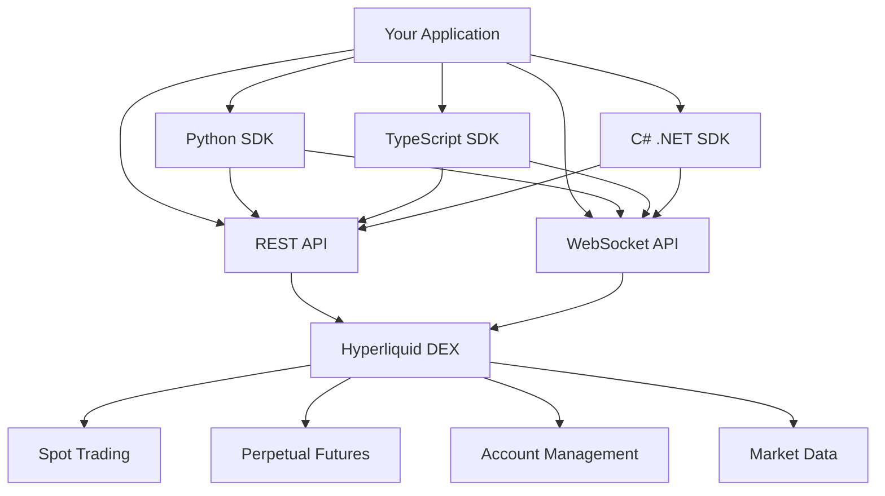

# Hyperliquid Documentation Hub

## Overview

Hyperliquid is a decentralized perpetual exchange that provides comprehensive APIs for trading, market data, and account management. This documentation hub contains detailed guides for building applications that interact with Hyperliquid across multiple programming languages and platforms.

## 📚 Documentation Structure

### Core Documentation
- **[API Endpoints](./api-endpoints.md)** - Complete REST and WebSocket API reference with examples
- **[Trading Strategies](./trading-strategies.md)** - Comprehensive guide to algorithmic trading strategies

### SDK Documentation
- **[Python SDK](./python-sdk.md)** - Official Python SDK with advanced examples and trading bots
- **[TypeScript SDK](./typescript-sdk.md)** - Multiple TypeScript/JavaScript SDKs with browser support
- **[C# .NET SDK](./csharp-net-sdk.md)** - HyperLiquid.Net library with full .NET integration

## 🚀 Quick Start Guides

### For Python Developers
```bash
pip install hyperliquid-python-sdk
```
👉 **[Get Started with Python SDK](./python-sdk.md)**

### For JavaScript/TypeScript Developers
```bash
npm install hyperliquid
# or
npm install @nktkas/hyperliquid
```
👉 **[Get Started with TypeScript SDK](./typescript-sdk.md)**

### For .NET Developers
```bash
dotnet add package HyperLiquid.Net
```
👉 **[Get Started with C# SDK](./csharp-net-sdk.md)**

## 🏗️ Architecture Overview

Hyperliquid provides multiple ways to interact with the platform:



## 📋 Features Covered

### Trading Operations
- **Order Management**: Place, cancel, modify orders
- **Advanced Order Types**: Stop-loss, take-profit, conditional orders
- **Position Management**: Leverage control, margin management
- **Risk Management**: Portfolio risk, position sizing

### Market Data
- **Real-time Data**: Live prices, order book, trades
- **Historical Data**: Candlesticks, funding rates, trade history
- **Market Analysis**: Technical indicators, volatility metrics

### Account Management
- **Portfolio Tracking**: Balance, positions, PnL
- **Transfer Operations**: Spot ↔ Perpetual transfers
- **Withdrawal Management**: USDC withdrawals to external wallets

### Advanced Features
- **Multi-signature Support**: Enterprise-grade security
- **WebSocket Streaming**: Low-latency real-time data
- **Batch Operations**: Efficient bulk order management
- **Custom Strategies**: Algorithmic trading implementations

## 🛠️ Implementation Examples

### Market Making Bot
```python
# Python Example
from hyperliquid.info import Info
from hyperliquid.exchange import Exchange

class MarketMaker:
    def __init__(self, config):
        self.info = Info(config['api_url'])
        self.exchange = Exchange(config)
    
    async def place_orders(self, symbol, spread):
        # Implementation in python-sdk.md
```

### Grid Trading Strategy
```typescript
// TypeScript Example
import * as hl from "@nktkas/hyperliquid";

class GridTrader {
    constructor(privateKey: string, config: any) {
        // Implementation in typescript-sdk.md
    }
}
```

### Portfolio Rebalancing
```csharp
// C# Example
using HyperLiquid.Net;

public class PortfolioManager
{
    private readonly HyperLiquidRestClient _client;
    
    public async Task RebalanceAsync()
    {
        // Implementation in csharp-net-sdk.md
    }
}
```

## 🔗 API Reference

### Base URLs
- **Mainnet API**: `https://api.hyperliquid.xyz`
- **Testnet API**: `https://api.hyperliquid-testnet.xyz`
- **WebSocket Mainnet**: `wss://api.hyperliquid.xyz/ws`
- **WebSocket Testnet**: `wss://api.hyperliquid-testnet.xyz/ws`

### Key Endpoints
- `POST /info` - Market data and account information
- `POST /exchange` - Trading operations (authenticated)
- WebSocket subscriptions for real-time data

👉 **[Complete API Reference](./api-endpoints.md)**

## 🔐 Authentication

Hyperliquid uses EIP-712 signature-based authentication:

1. Create action object
2. Sign with private key using EIP-712
3. Include signature and nonce in request

```typescript
import { signL1Action } from "@nktkas/hyperliquid/signing";

const signature = await signL1Action({
  wallet: privateKey,
  action: sortedAction,
  nonce: Date.now()
});
```

## 📊 Trading Strategies Included

Our comprehensive strategy documentation covers:

### Market Making
- **Basic Market Making**: Spread capture strategies
- **Advanced Market Making**: Inventory management, dynamic spreads
- **Risk-adjusted Market Making**: Volatility-based pricing

### Directional Strategies
- **Momentum Trading**: Trend-following algorithms
- **Mean Reversion**: Bollinger Bands, RSI strategies
- **Grid Trading**: Static and dynamic grid systems

### Portfolio Strategies
- **Multi-asset Management**: Cross-asset portfolio balancing
- **Risk Parity**: Equal risk contribution strategies
- **Correlation Trading**: Pairs and statistical arbitrage

👉 **[Complete Strategy Guide](./trading-strategies.md)**

## 🚨 Risk Management

All our documentation includes comprehensive risk management:

- **Position Sizing**: Kelly criterion, fixed fractional
- **Stop Losses**: Trailing stops, volatility-based stops
- **Portfolio Risk**: Correlation limits, concentration limits
- **Operational Risk**: Rate limiting, error handling

## 🔧 Tools & Utilities

### Development Tools
- **Testing Framework**: Testnet integration examples
- **Error Handling**: Robust retry mechanisms
- **Logging**: Comprehensive logging strategies
- **Monitoring**: Performance and risk monitoring

### Production Ready Features
- **Connection Management**: Auto-reconnection, failover
- **Rate Limiting**: Built-in rate limit handling
- **Security**: Best practices for key management
- **Scalability**: Multi-threaded and async implementations

## 🌐 Supported Platforms

### Languages
- **Python 3.8+**: Official SDK with comprehensive features
- **JavaScript/TypeScript**: Multiple SDK options with browser support
- **C# .NET**: Full .NET Framework and .NET Core support

### Environments
- **Desktop Applications**: Windows, macOS, Linux
- **Web Applications**: Browser-based trading interfaces
- **Mobile**: React Native support with polyfills
- **Server**: High-frequency trading servers

### Cloud Platforms
- **AWS**: Lambda, EC2, ECS deployment examples
- **Docker**: Containerized deployment configurations
- **Kubernetes**: Scalable trading bot deployments

## 📈 Performance Considerations

### Latency Optimization
- **WebSocket Connections**: Persistent connections for real-time data
- **Connection Pooling**: Efficient HTTP connection management
- **Geographic Proximity**: Server location recommendations

### Throughput Optimization
- **Batch Operations**: Multiple orders in single requests
- **Asynchronous Processing**: Non-blocking operation patterns
- **Caching Strategies**: Market data and calculation caching

## 🤝 Community & Support

### Getting Help
- **Documentation**: Comprehensive guides and examples
- **Error Codes**: Detailed error handling documentation
- **Best Practices**: Production-ready implementation patterns

### Contributing
- **Bug Reports**: How to report issues effectively
- **Feature Requests**: Enhancement proposal process
- **Code Examples**: Community strategy sharing

## 📝 Legal & Compliance

- **Terms of Service**: Hyperliquid platform terms
- **API Usage**: Rate limits and fair usage policies
- **Risk Disclosure**: Trading risks and disclaimers
- **Jurisdiction**: Regulatory considerations

---

## 🎯 Next Steps

1. **Choose Your Language**: Select Python, TypeScript, or C# based on your preference
2. **Read the SDK Guide**: Follow the comprehensive documentation for your chosen language
3. **Explore Strategies**: Review the trading strategies documentation
4. **Test on Testnet**: Use testnet for safe development and testing
5. **Implement Risk Management**: Always implement proper risk controls
6. **Start Small**: Begin with paper trading or small position sizes

**Happy Trading! 🚀**

---

*This documentation is maintained and updated regularly. Last updated: January 2025* 